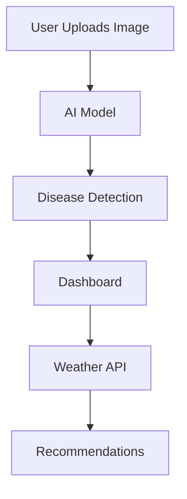

<div align="center">

# 🌾 Farmer Mithra 2026

### 🚀 AI-Powered Smart Farming Assistant


<br><br>


</div>

---

## 🚀 About the Project

<div>

Farmer Mithra is an **AI-powered assistant** designed to help farmers make better decisions using:

* 🌿 Crop disease detection
* 🌦️ Weather-based insights
* 📊 Smart dashboards
* 🔐 Secure system access

</div>

---

## 🧠 Features

<div>

✨ AI Crop Disease Detection
🌦️ Real-time Weather API
📊 Interactive Dashboard
🔐 Login & Admin Panel
📡 Smart Recommendations

</div>

---

## 🛠️ Tech Stack

<div align="center">


</div>

---

## 📂 Project Structure

```bash
FarmerMithra/
│── backend/
│   ├── app.py
│   ├── farmers_db
│   ├── vendors_db
│
│── frontend/
│   ├── login.html
│   ├── dashboard.html
│   ├── adminpanel.html
│   ├── style.css
│
│── README.md
```

---

## ⚡ Setup Instructions

```bash
git clone https://github.com/kishan-maker136/farmermithra2026.git
cd farmermithra2026
pip install -r requirements.txt
python backend/app.py
```

---

## 🌐 Workflow



---

## 📸 Preview

<div align="center">


</div>

---

## 🚀 Future Scope

<div>

📱 Mobile App
🌍 Multi-language Support
📡 IoT Integration
🧠 Advanced AI

</div>

---

## 👨‍💻 Developer

<div align="center">

**Algo Boy's**
🚀 AI Innovators

</div>

---

## ⭐ Support

<div align="center">

If you like this project, give it a ⭐ on GitHub

</div>

---

<div align="center">

### 🌾 Made with ❤️ for Farmers

</div>
